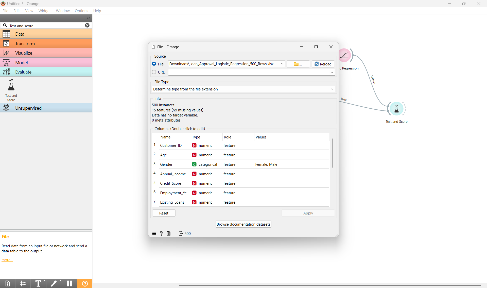
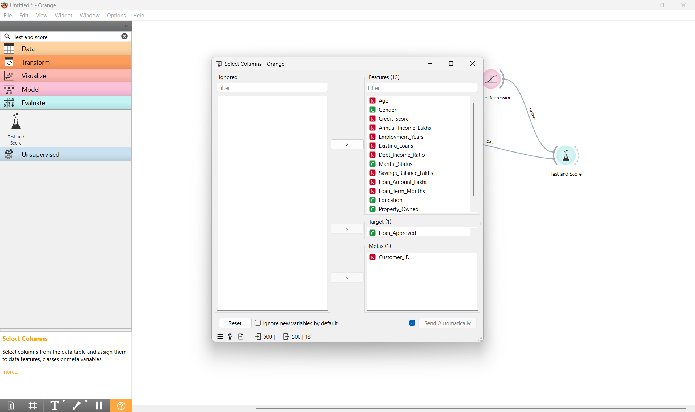
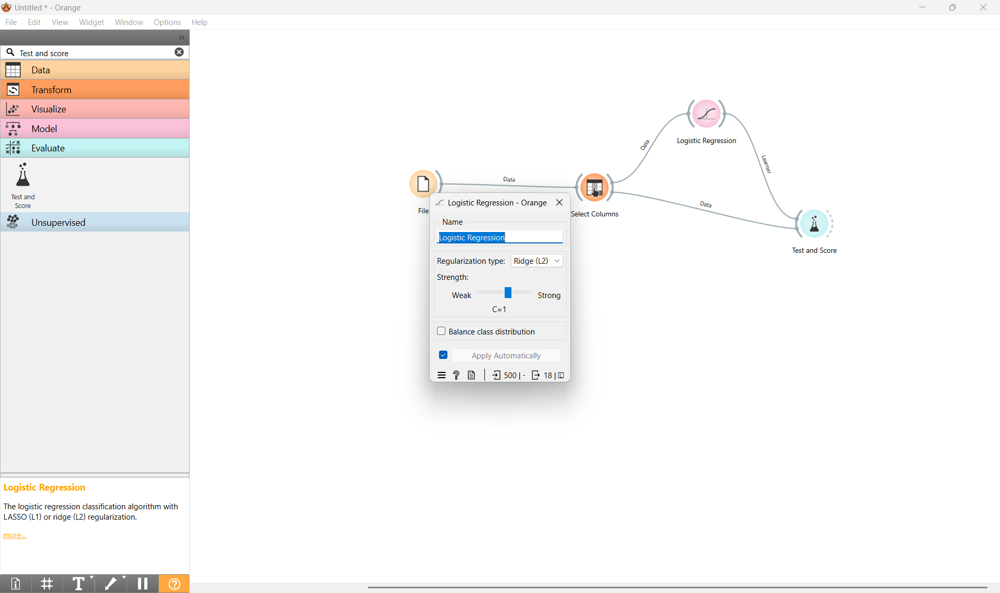
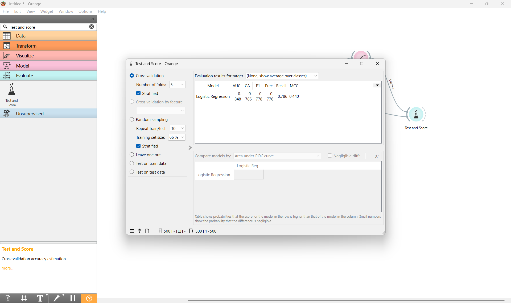

# Loan Approval Prediction Using Logistic Regression

An end-to-end classification machine learning project built using **Orange Data Mining**. This project utilizes a Ridge (L2) Regularized Logistic Regression model to predict whether a customer will be approved for a loan based on financial status, credit scores, and demographic data.

---

## 🚀 Project Overview

Predicting loan approvals manually is time-consuming and prone to human bias. This project implements an automated, visual data mining pipeline to classify applicants into approved or rejected statuses. 

The dataset contains **500 instances** with **15 features**, requiring zero missing value treatment.

### Key Features Used:
*   **Demographics:** Age, Gender, Marital Status, Education
*   **Financial Metrics:** Annual Income (Lakhs), Savings Balance (Lakhs), Debt-to-Income Ratio
*   **Loan Details:** Loan Amount (Lakhs), Loan Term (Months), Existing Loans, Property Owned
*   **Credit Worthiness:** Credit Score, Employment Years

---

## 🛠️ Workflow Architecture & Screenshots

The Orange workflow processes data linearly from ingestion to evaluation. Below is the step-by-step documentation of the pipeline nodes:

### 1. Data Ingestion
The dataset `Loan_Approval_Logistic_Regression_500_Rows.xlsx` is imported into the pipeline. At this stage, data types are automatically inferred from the file extension.



### 2. Feature Selection & Target Mapping
Using the column selection node, variables are organized structurally:
*   **Target (1):** `Loan_Approved` (Categorical outcome variable)
*   **Metas (1):** `Customer_ID` (Ignored during training to prevent overfitting)
*   **Features (13):** All remaining numeric and categorical predictors



### 3. Model Configuration
A **Logistic Regression** classifier is connected to the features. It is configured with **Ridge (L2) Regularization** at a balanced strength configuration ($C=1$) to prevent data overfitting.



### 4. Evaluation (Test and Score)
The model's predictive power is evaluated using a **5-fold Stratified Cross-Validation** approach to guarantee stability across different data slices.



---

## 📊 Model Evaluation Results

The model achieved strong classification metrics across the 500 records:

| Metric | Score / Value | Description |
| :--- | :--- | :--- |
| **AUC** | 0.848 | High discriminative ability between approved/rejected classes |
| **CA (Classification Accuracy)** | 0.786 | 78.6% overall correct predictions |
| **F1-Score** | 0.778 | Strong balance between Precision and Recall |
| **Precision** | 0.776 | Minimal false positive loan assignments |
| **Recall** | 0.786 | Successfully captures true loan candidates |

---

## 💻 How to Run This Project

1. Download and install [Orange Data Mining](https://orangedatamining.com/).
2. Clone this repository to your local machine:
```bash
   git clone [https://github.com/YOUR_USERNAME/loan-approval-prediction-orange.git](https://github.com/YOUR_USERNAME/loan-approval-prediction-orange.git)
